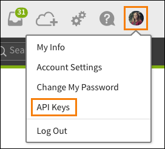

# bamboohrapi

this is the shell script for anyone who want to do timeoff request via BambooHR system.

the code example is here

```
parameter 1 apikey, the key can be found from BambooHR system, click avatar then API Keys
parameter 2 operation (test/requests/timeoff)
parameter 3 employeeid for timeoff
parameter 4 startdate for timeoff (YYYY-MM-DD)
parameter 5 enddate for timeoff (YYYY-MM-DD)
example:
sh bamboohr.sh xxxxxxxxxxxxxx timeoff 1 2018-10-01 2018-10-02
```

you may need to know the api key and employee id, before you use it.

for api key id



for employee id, you can find it out at somewhere tagged as "employeeId"
```
sh bamboohr.sh xxxxxxxxxxxxxx requests
```